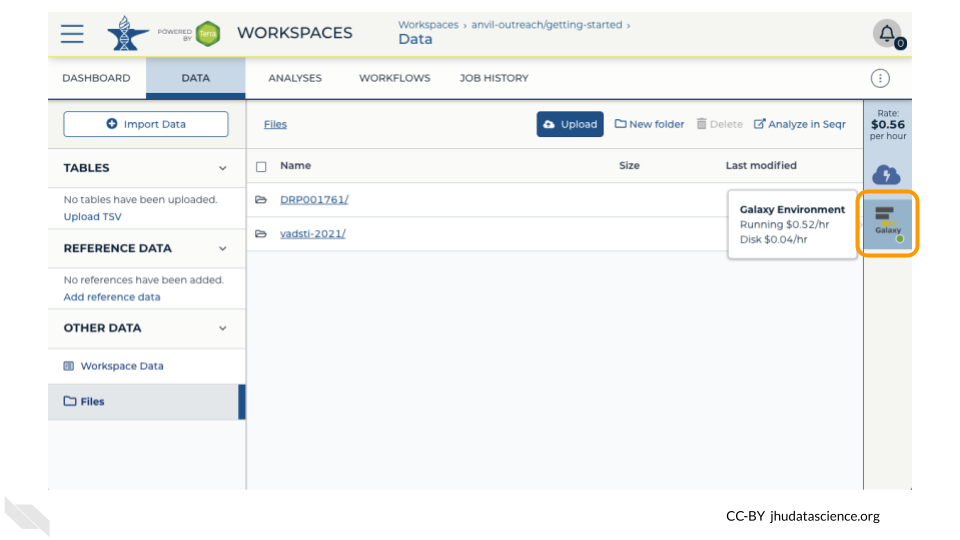
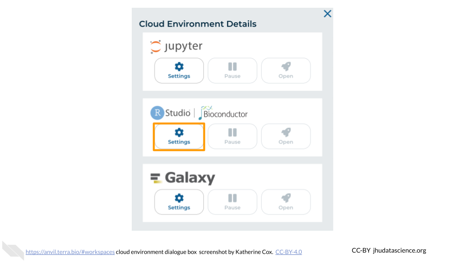
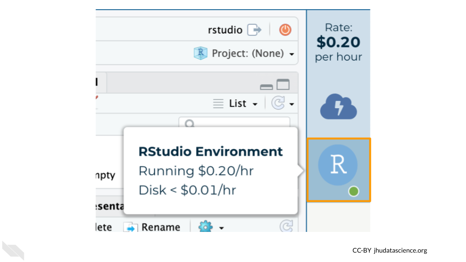

# Using programming platforms on AnVIL

Modules about opening, touring, and closing AnVIL platforms

<br>

## Video overview on using Jupyter Notebooks 

:::: {.borrowed_chunk}

Here is a video tutorial that describes the basics of using Jupyter Notebook on AnVIL.

<iframe src="https://drive.google.com/file/d/1ZhPYFy4zuAHhPhF6T4pUgSReBmPJM-wg/preview" width="640" height="360" allow="autoplay"></iframe>

### Objectives

- Start compute for your Jupyter environment
- Create notebook to perform analysis
- Stop compute to minimize expenses

### Slides

The slides for this tutorial are are located [here](https://docs.google.com/presentation/d/1GYUP874Qd7K3S0Ls6iWY_M4jywpRb53qw0f78OBCFwk).
::::

## Launching Jupyter

:::: {.borrowed_chunk}

:::{.warning}
AnVIL is very versatile and can scale up to use very powerful cloud computers. It's very important that you select a cloud computing environment appropriate to your needs to avoid runaway costs.  If you are uncertain, start with the default settings; it is fairly easy to increase your compute resources later, if needed, but harder to scale down.
:::

Note that, in order to use Jupyter, you must have access to a Terra Workspace with permission to compute (i.e. you must be a "Writer" or "Owner" of the Workspace).

1. Open Terra - use a web browser to go to [`anvil.terra.bio`](https://anvil.terra.bio/)

1. In the drop-down menu on the left, navigate to "Workspaces". Click the triple bar in the top left corner to access the menu. Click "Workspaces".

    

1. Click on the name of your Workspace. You should be routed to a link that looks like: `https://anvil.terra.bio/#workspaces/<billing-project>/<workspace-name>`.

1. Click on the cloud icon on the far right to access your Cloud Environment options.  If you don’t see this icon, you may need to scroll to the right.

    

1. In the dialogue box, click the "Settings" button under Jupyter.

    

1. You will see some configuration options for the Jupyter cloud environment, and a list of costs because it costs a small amount of money to use cloud computing.

    


1. Configure any settings you need for your cloud environment.  If you are uncertain about what you need, the default configuration is a reasonable, cost-conservative choice.  It is fairly easy to increase your compute resources later, if needed, but harder to scale down. Scroll down and click the "CREATE" button when you are satisfied with your setup.

    

    

    

    

    

    

    

1. The dialogue box will close and you will be returned to your Workspace.  You can see the status of your cloud environment by hovering over the Jupyter icon.  It will take a few minutes for Terra to request computers and install software.

    

1. When your environment is ready, its status will change to "Running".  Click on the "ANALYSES" tab to create or open a Jupyter Notebook.

    

1. From the ANALYSES tab, you can click on the name of an existing Jupyter Notebook to view and launch it, or click the "START" button to create a new Notebook.

    


1. Clicking on a Notebook name will open a static preview of the Notebook.  To edit and run the Notebook, click the "OPEN" button.

    
::::

## Video overview on using Galaxy

:::: {.borrowed_chunk}

Here is a video tutorial that describes the basics of using Galaxy on AnVIL.

<iframe width="560" height="315" src="https://www.youtube.com/embed/9TEVu7QobOo?si=a1IR17kSNUs4bTaD" title="YouTube video player" frameborder="0" allow="accelerometer; autoplay; clipboard-write; encrypted-media; gyroscope; picture-in-picture; web-share" referrerpolicy="strict-origin-when-cross-origin" allowfullscreen></iframe>

### Objectives

- Start compute for your Galaxy on AnVIL
- Run tool to quality control sequencing reads
- Stop compute to minimize expenses

### Slides

The slides for this tutorial are are located [here](https://docs.google.com/presentation/d/1yYCg4cPVBMMDghT17B4XzROieqyMH99Ex9nMm_Scm9Q/edit?usp=sharing).
::::

## Starting Galaxy

:::: {.borrowed_chunk}

Note that, in order to use Galaxy, you must have access to a Terra Workspace with permission to compute (i.e. you must be a "Writer" or "Owner" of the Workspace).

Open your Workspace, and click on the “Environment configuration” button, a cloud icon on the righthand side of the screen. 


Under Galaxy, click on “Create new Environment”. Click on “Next” and “Create” to keep all settings as-is. This will take 8-10 minutes.


Click on "Open Galaxy" when the environment is ready.


::::

## Navigating Galaxy

:::: {.borrowed_chunk}

Notice the three main sections.

**Tools** - These are all of the bioinformatics tool packages available for you to use.

**The Main Dashboard** - This contains flash messages and posts when you first open Galaxy, but when we are using data this is the main interface area.

**History** - When you start a project you will be able to see all of the documents in the project in the history. Now be aware, this can become very busy. Also the naming that Galaxy uses is not very intuitive, so you must make sure that you label your files with something that makes sense to you.


On the welcome page, there are links to tutorials. You may try these out on your own. If you want to try a new analysis this is a good place to start.
::::

## Deleting Galaxy

:::: {.borrowed_chunk}

Once you are done with your activity, you’ll need to shut down your Galaxy cloud environment. This frees up the cloud resources for others and minimizes computing cost. The following steps will delete your work, so make sure you are completely finished at this point. Otherwise, you will have to repeat your work from the previous steps.

Return to AnVIL, and find the Galaxy logo that shows your cloud environment is running. Click on this logo.



Next, click on "Settings". Click on "Delete Environment".


Finally, select "Delete everything, including persistent disk". Make sure you are done with the activity and then click "Delete".


::::

## Video overview on using RStudio

:::: {.borrowed_chunk}

Here is a video tutorial that describes the basics of using RStudio on AnVIL.

<iframe src="https://drive.google.com/file/d/1v72ZG8JIRDUaewFQgGfcCO_qoM4eYmYX/preview" width="640" height="360" allow="autoplay"></iframe>

### Objectives

- Start compute for your RStudio environment
- Tour RStudio on AnVIL
- Stop compute to minimize expenses

### Slides

The slides for this tutorial are are located [here](https://docs.google.com/presentation/d/1eypYLLqD11-NwHLs4adGpcuSB07dYEJfAaALSMvgzqw).
::::

## Launching RStudio

:::: {.borrowed_chunk}

:::{.warning}
AnVIL is very versatile and can scale up to use very powerful cloud computers. It's very important that you select a cloud computing environment appropriate to your needs to avoid runaway costs.  If you are uncertain, start with the default settings; it is fairly easy to increase your compute resources later, if needed, but harder to scale down.
:::

Note that, in order to use RStudio, you must have access to a Terra Workspace with permission to compute (i.e. you must be a "Writer" or "Owner" of the Workspace).

1. Open Terra - use a web browser to go to [`anvil.terra.bio`](https://anvil.terra.bio/)

1. In the drop-down menu on the left, navigate to "Workspaces". Click the triple bar in the top left corner to access the menu. Click "Workspaces".

    

1. Click on the name of your Workspace. You should be routed to a link that looks like: `https://anvil.terra.bio/#workspaces/<billing-project>/<workspace-name>`.

1. Click on the cloud icon on the far right to access your Cloud Environment options.  If you don’t see this icon, you may need to scroll to the right.

    

1. In the dialogue box, click the "Settings" button under RStudio.

    

1. You will see some configuration options for the RStudio cloud environment, and a list of costs because it costs a small amount of money to use cloud computing.

    


1. Configure any settings you need for your cloud environment.  If you are uncertain about what you need, the default configuration is a reasonable, cost-conservative choice.  It is fairly easy to increase your compute resources later, if needed, but harder to scale down. Scroll down and click the "CREATE" button when you are satisfied with your setup.

    

    

    

    

    

    

    

1. The dialogue box will close and you will be returned to your Workspace.  You can see the status of your cloud environment by hovering over the RStudio icon.  It will take a few minutes for Terra to request computers and install software.

    

1. When your environment is ready, its status will change to "Running".  Click on the RStudio logo to open a new dialogue box that will let you launch RStudio.

    
    
1. Click the launch icon to open RStudio.  This is also where you can pause, modify, or delete your environment when needed.

    

1. You should now see the RStudio interface with information about the version printed to the console.

    

:::{.dictionary}
For more information about configuring your RStudio environment, you can check the Terra docs:

- [Starting and customizing your RStudio app](https://support.terra.bio/hc/en-us/articles/360058138632-Starting-and-customizing-your-RStudio-app)
- [What packages are installed on preconfigured Cloud Environments?](https://support.terra.bio/hc/en-us/articles/360060989111-What-packages-are-installed-on-preconfigured-Cloud-Environments)
- [Preconfigure a Cloud Environment with a startup script](https://support.terra.bio/hc/en-us/articles/360058193872-Preconfigure-a-Cloud-Environment-with-a-startup-script)
- [Cloud Environment FAQs](https://support.terra.bio/hc/en-us/articles/360057425291-Cloud-Environment-FAQs)
:::
::::

## Touring RStudio

:::: {.borrowed_chunk}

Next, we will be using RStudio and the package `Glimma` to create interactive plots. See [this vignette](https://bioconductor.org/packages/release/bioc/vignettes/Glimma/inst/doc/limma_edger.html) for more information.

::: {.notice}
If you need to load data stored in your workspace or a GCP bucket, you'll need to use the [AnVILGCP package](https://bioconductor.org/packages/release/bioc/vignettes/AnVILGCP/inst/doc/AnVILGCPIntroduction.html) to load it into RStudio.

The example in this walkthrough uses data from an imported R package.  
:::

1. The Bioconductor team has created a very useful package to programmatically interact with Terra and Google Cloud. Install the `AnVIL` package. It will make some steps easier as we go along.

    
    ``` r
    BiocManager::install("AnVIL")
    ```

    

1. You can now quickly install precompiled binaries using the AnVIL package’s `install()` function. We will use it to install the `Glimma` package and the `airway` package. The `airway` package contains a `SummarizedExperiment` data class. This data describes an RNA-Seq experiment on four human airway smooth muscle cell lines treated with dexamethasone.

    {Note: for some of the packages, you will have to install packaged from the CRAN repository, using the `install.packages()` function. The examples will show you which install method to use.}

    
    ``` r
    AnVIL::install(c("Glimma", "airway"))
    ```

    

1. Load the example data.

    
    ``` r
    library(airway)
    data(airway)
    ```

    

1. The multidimensional scaling (MDS) plot is frequently used to explore differences in samples. When this data is MDS transformed, the first two dimensions explain the greatest variance between samples, and the amount of variance decreases monotonically with increasing dimension. The following code will launch a new window where you can interact with the MDS plot.

    
    ``` r
    Glimma::glimmaMDS(assay(airway), group = colData(airway)$dex)
    ```

    

1. Change the `colour_by` setting to "groups" so you can easily distinguish between groups. In this data, the "group" is the treatment.

    

1. You can download the interactive html file by clicking on "Save As".

    

1. You can also download plots and other files created directly in RStudio. To download the following plot, click on "Export" and save in your preferred format to the default directory. This saves the file in your cloud environment.

    
    ``` r
    limma::plotMDS(airway)
    ```

    

1. You should see the plot in the "Files" pane.

    

1. Select this file and click "More" > "Export"

    

1. Select "Download" to save the file to your local machine.

    
::::

## Pausing RStudio

:::: {.borrowed_chunk}

When you are not actively performing an analysis (but will be returning soon), you should “pause” your cloud environment to minimize costs. This will release the CPU and memory resources for other people to use. Your files will be saved and will continue to accrue a small storage cost.

Before pausing, it’s a good idea to transfer any important files out of your cloud environment. While a paused environment does preserve your files, it has no backup mechanism, so if anything happens to your cloud environment those files will be lost. If there is anything you would like to save permanently, it’s a good idea to copy it to another location, such as the Workspace bucket, GitHub, or your local machine.

**To pause your cloud environment**:

1. You can view costs and make changes to your cloud environments from the panel on the far right of the page.  If you don’t see this panel, you may need to scroll to the right.  Running environments will have a green dot, and paused environments will have an orange dot.

    

1. Hovering over the RStudio icon will show you the costs associated with your RStudio environment.  Click on the RStudio icon to open the cloud environment settings.

    

1. Click the Pause button to pause RStudio.  This will take a few minutes.

    

1. When the environment is paused, an orange dot will be displayed next to the RStudio icon.  If you hover over the icon, you will see that it is paused, and has a small ongoing cost as long as it is paused.  When you’re ready to resume working, you can do so by clicking the RStudio icon and clicking Resume.

    

:::{.notice}
You can also pause your cloud environment(s) at https://anvil.terra.bio/#clusters.
:::
::::

## Deleting RStudio

:::: {.borrowed_chunk}

1. Pausing your cloud environment only temporarily stops your work. When you are ready to delete the cloud environment, click on the RStudio icon on the right-hand side and select “Settings”.  If you don’t see this icon, you may need to scroll to the right.

    

1. Click on “Delete Environment”.

    

1. If you are certain that you do not need the data and configuration on your disk, you should select "Delete everything, including persistent disk".  If there is anything you would like to save, open the compute environment and copy the file(s) from your compute environment to another location, such as the Workspace bucket, GitHub, or your local machine, depending on your needs.

    

1. Select "DELETE".

    

:::{.notice}
You can also delete your cloud environment(s) and disk storage at https://anvil.terra.bio/#clusters.
:::
::::

## Pausing vs. Deleting cloud environments

These instructions can be customized by setting the following variables in `AnVIL_module_settings` before running `cow::borrow_chapter()`:

- `cloud_environment`: (string) specify the type of cloud environment. Defaults to "your cloud environment"
- `include_pd_details`: (bool) whether to include an explanation about keeping the Persistent Disk. Defaults to FALSE

### Generic cloud environment, with PD details

```
AnVIL_module_settings <- list(include_pd_details = TRUE)
cow::borrow_chapter(
  doc_path = "child/_child_cloud_environment_pause_vs_delete.Rmd",
  repo_name = "jhudsl/AnVIL_Template"
)
```

:::: {.borrowed_chunk}

Cloud computing costs are based on the amount of time you use the computing resources, so it's important to clean up after yourself when you're done, and not just leave the computers running.

There are two ways to "shut down" your cloud environment on AnVIL:

- **Pause** the environment: This will save a copy of your work, and then release the computers for other people to use them.  **Do this if you plan to continue working in your cloud environment**.
    - It's similar to turning off your computer or phone - when you start it back up, everything will be where you left it.
    - This still costs a small amount of money, but much less than leaving the computer running.  
- **Delete** the environment: This will delete everything and then release the computers for other people to use them.  **Do this if you are completely finished working**, or if your future work will be in a new environment.
    - It's similar to throwing your computer or phone in the trash!
    - **You will not be able to recover your work.**
    - Make sure you have saved anything you need to another location (such as the Workspace bucket, GitHub, or your local machine) before you delete your environment.


:::{.notice}
You can also **delete the environment but keep the Persistent Disk** (this is like keeping the hard drive while throwing away the rest of the computer). However in practice this is rarely preferable. You will continue to be charged for the Persistent Disk, and the **Persistent Disk is both more expensive and less stable than your Workspace bucket**. Anything that you want to keep long-term should be moved to your Workspace bucket.

Some examples of when you might want to delete the environment but keep the persistent disk:

- You need to make certain types of changes to the cloud environment, which require you to delete and then recreate the environment. The PD allows you to safely delete your old environment and then attach the PD to the new environment, preserving your files.
- You will not be using the cloud environment for a while **AND** it would be difficult to recreate the contents of the disk. Sometimes there may be files (such as intermediate results or complicated package installations) that don't need to be preserved long-term, but would be inconvenient to replace. The Persistent Disk can be used to keep those files around until you are ready to return to them, without incurring the cost of maintaining a paused cloud environment. Just keep in mind that (1) there is still a cost for the PD itself, which depends on the size of the PD, and (2) the PD is not backed up, so the files may be lost if something goes wrong with your cloud environment or PD.
:::
::::

### RStudio, with no PD details

```
AnVIL_module_settings <- list(cloud_environment = "RStudio")
cow::borrow_chapter(
  doc_path = "child/_child_cloud_environment_pause_vs_delete.Rmd",
  repo_name = "jhudsl/AnVIL_Template"
)
```

:::: {.borrowed_chunk}

Cloud computing costs are based on the amount of time you use the computing resources, so it's important to clean up after yourself when you're done, and not just leave the computers running.

There are two ways to "shut down" RStudio on AnVIL:

- **Pause** the environment: This will save a copy of your work, and then release the computers for other people to use them.  **Do this if you plan to continue working in RStudio**.
    - It's similar to turning off your computer or phone - when you start it back up, everything will be where you left it.
    - This still costs a small amount of money, but much less than leaving the computer running.  
- **Delete** the environment: This will delete everything and then release the computers for other people to use them.  **Do this if you are completely finished working**, or if your future work will be in a new environment.
    - It's similar to throwing your computer or phone in the trash!
    - **You will not be able to recover your work.**
    - Make sure you have saved anything you need to another location (such as the Workspace bucket, GitHub, or your local machine) before you delete your environment.
::::

