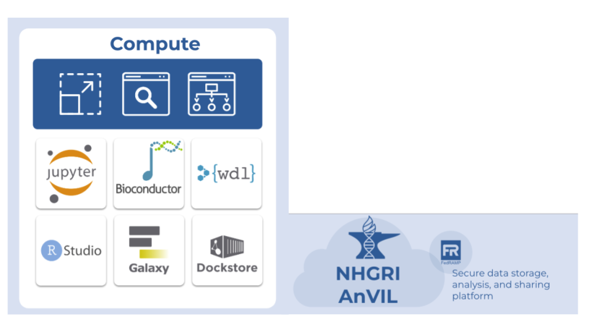
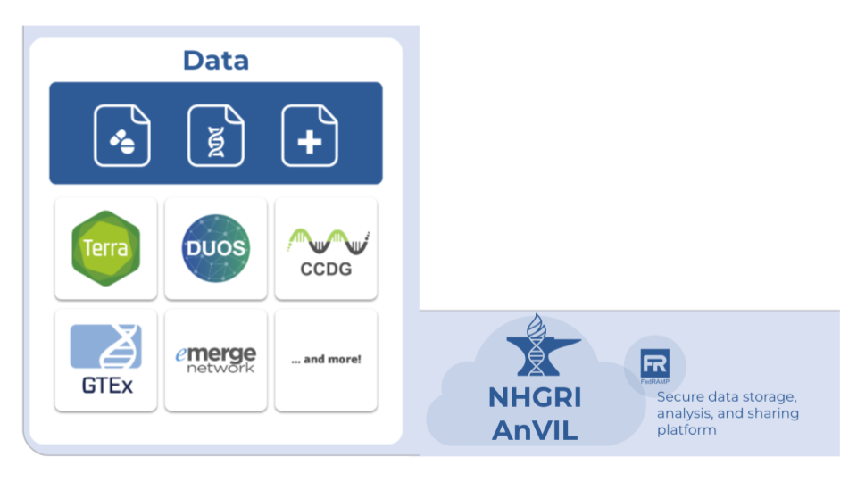
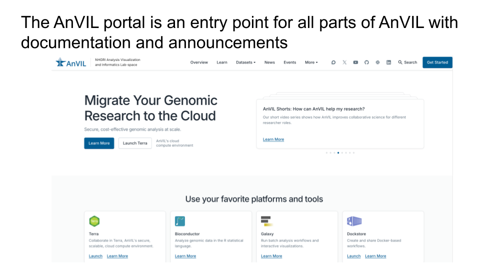
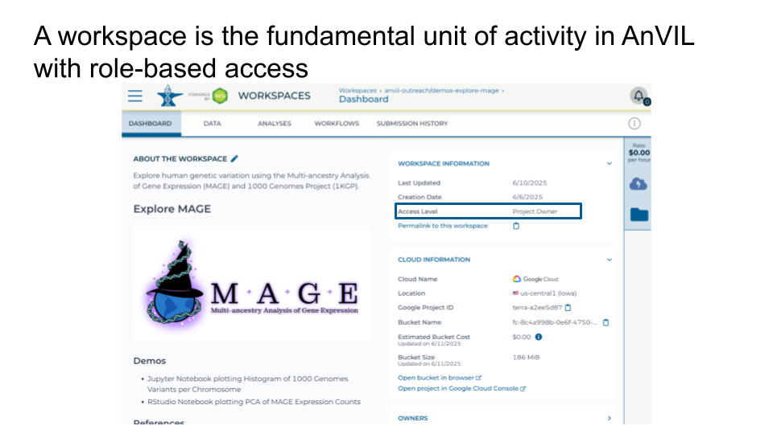
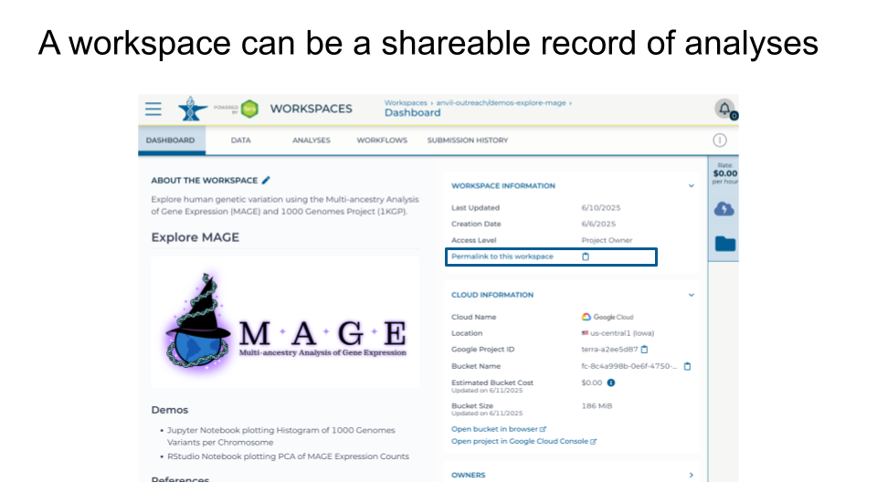
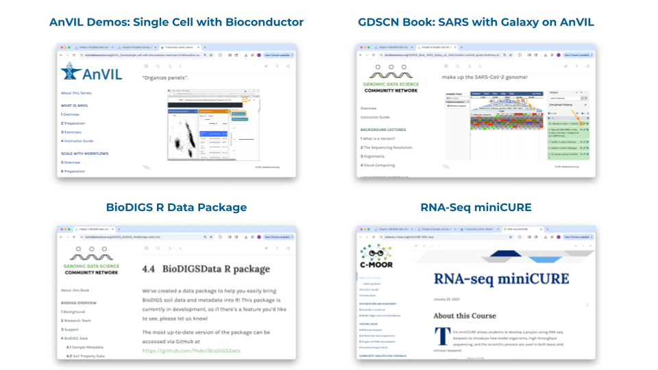
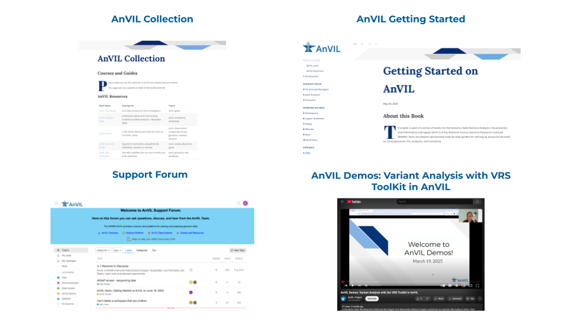
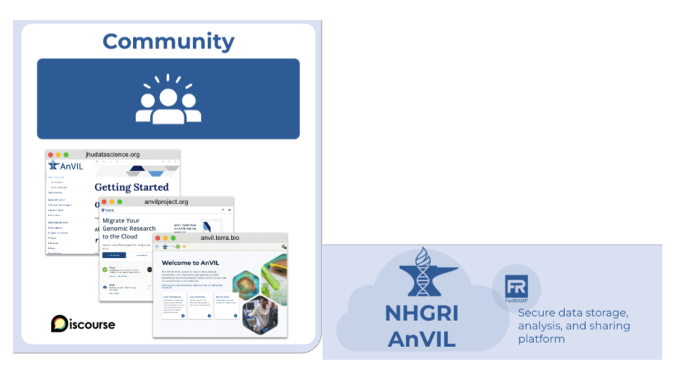
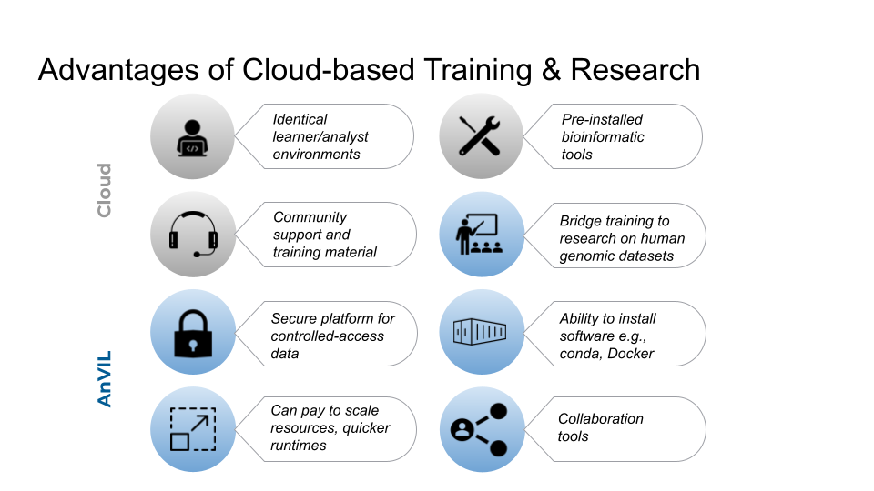

# Why use AnVIL?

The NHGRI AnVIL (Genomic Data Science Analysis, Visualization, and Informatics Lab-space) is a project powered by Terra for biomedical researchers to access data, run analysis tools, and collaborate. Both biology researchers and educators can benefit from using AnVIL ([anvil.terra.bio](anvil.terra.bio)) for their research and in the classroom. This guide acts as a resource answering the question "why use AnVIL?".

## Benefits of using AnVIL for research

### User-friendly process of accessing and interacting with the AnVIL platform

The primary means of accessing the AnVIL platform ([anvil.terra.bio](anvil.terra.bio)) is through a web browser - users do not need to download data or install software.

Accessing AnVIL beyond the web browser

The platform ([anvil.terra.bio](anvil.terra.bio)) provides a variety of graphical user interfaces (GUIs) as well as optional application programming interface (API) library/command line interfaces to interact with data, analysis solutions, and workflows. Bioconductor packages ([AnVIL](https://www.bioconductor.org/packages/release/bioc/vignettes/AnVIL/inst/doc/Introduction.html), [AnVILGCP](https://www.bioconductor.org/packages/release/bioc/html/AnVILGCP.html), [AnVILWorkflow](https://www.bioconductor.org/packages/release/bioc/html/AnVILWorkflow.html)) offer additional methods for users to programmatically interact with and access AnVIL resources from within AnVIL, or stand-alone computing environments such as a user's laptop.

### Variety of available analysis solutions/frameworks and tools

AnVIL supports an assortment of frameworks and tools such that researchers can use their favorite to work with their data interactively or through non-interactive batch processing. Due to this variety and interoperability with other platforms, researchers are enabled to stay within a single environment for their analysis without having to shift between platforms and use their favorite tooling to analyze their data.

Interactive sessions

Interactive sessions are available with Jupyter, RStudio/Bioconductor, and Galaxy.

Use of Galaxy on AnVIL enables even more customizability with the ability to [install specific tools/versions with Toolshed](https://support.terra.bio/hc/en-us/articles/4402392877979-Galaxy-on-Terra-FAQs#heading-12).

Non-interactive batch processing

Workflows can be [user-supplied/written](https://jhudatascience.org/AnVIL_Book_WDL/write-wdl.html#export-to-anvil-powered-by-terra-and-run) or [imported with Dockstore](https://jhudatascience.org/AnVIL_Book_WDL/import-and-configure-workflows.html) and used to steer non-interactive pipelines and batch processing of data.

### Ability to bring your own data or (with proper permissions) work with controlled access data

AnVIL securely stores diverse, open and controlled access, cloud-hosted datasets with a browsable summary catalog so researchers can identify relevant datasets they may need to request access to.

Consortia Data on the AnVIL

Data on the AnVIL includes data from consortia such as

* [The Amyotrophic Lateral Sclerosis (ALS) Compute Project](https://anvilproject.org/news/2023/09/05/data-release-als-compute-project)
* [NIH Intramural Center for Alzheimer's and Related Dementias (CARD)](https://anvilproject.org/news/2023/03/17/data-release-card-dementia-long-read-project)
* [The Centers for Common Disease Genomics (CCDG)](https://www.genome.gov/Funded-Programs-Projects/NHGRI-Genome-Sequencing-Program/Centers-for-Common-Disease-Genomics)
* [The Centers for Mendelian Genomics (CMG)](https://www.genome.gov/Funded-Programs-Projects/NHGRI-Genome-Sequencing-Program/Centers-for-Mendelian-Genomics-CMG)
* [Genomics Research to Elucidate the Genetics of Rare diseases (GREGoR)](https://anvilproject.org/news/2024/11/21/gregor-consortium)
* [Genotype-Tissue Expression (GTEx) project](https://anvilproject.org/news/2024/11/20/gtexv10)
* [International Fetal Genomics Consortium (IFGC)](https://www.fetalgenomics.org/)
* [The 1000 Genomes Project](https://www.internationalgenome.org/)
* [The Clinical Sequencing Evidence-Generating Research (CSER) consortium](https://anvilproject.org/consortia/cser)
* [The Electronic and MEdical Records and Genomics project (eMERGE)](https://emerge-network.org/)
* [The Population Architecture Using Genomics and Epidemiology Consortium (PAGE)](https://www.genome.gov/Funded-Programs-Projects/Population-Architecture-Using-Genomics-and-Epidemiology)
* [The Human Pangenome Reference Consortium (HPRC)](https://anvilproject.org/news/2021/03/11/hprc-on-anvil)
* [Telomere-to-Telomere (T2T)](https://anvilproject.org/news/2023/03/17/data-release-telomere-to-telomere)

[Additional consortia or upcoming planned data ingestion can be found on the AnVIL project portal](https://anvilproject.org/consortia). By inverting the typical method of genomic analysis, AnVIL brings a computing environment to the data rather than moving the data from storage to the computing environment or stories copies of the data across institutional high performance computing clusters.

Amount of data on AnVIL

As discussed in the [flagship AnVIL paper](https://www.cell.com/cell-genomics/fulltext/), the AnVIL hosts data from >280,000 human genomes from >240 different cohorts spanning multiple consortia and major NHGRI projects. The AnVIL offers a browsable catalog of summary information about all of the datasets so that even if a user isn't authorized to access the data itself, they can better determine if the data will be helpful for their research if they need to apply for authorization for access. AnVIL is working to facilitate data harmonization across studies, ensuring consistency and interoperability, which is critical for large-scale analyses. These efforts will increase the value of the AnVIL data and maximize its utility to the researcher community.

AnVIL is a FedRAMP Moderate compliant platform

As a [FedRAMP Moderate compliant platform](https://www.fedramp.gov/rev5/baselines/), AnVIL maintains FedRAMP authorization of compliance to ensure as a cloud service provider, minimum security requirements are met for data processing, storage, and transmission of Protected Health Information (PHI) and Personally Identifiable Information (PII) where loss of confidentiality, integrity, and availability would result in serious adverse effect or non-life threatening harm. All steps necessary to maintain compliance, such as robust logging of access to data, periodic audits by third-party analysts, and monitoring for abnormal use patterns are managed and guaranteed by AnVIL.

### Data and analysis methods in one place

AnVIL is a unified computing environment for data storage, management, and analysis. The [AnVIL portal](https://anvilproject.org) serves as an entry point to access all parts of the AnVIL system as well as training materials and announcements. 

### Scalability and flexibility in use

AnVIL is conducive to analysis at massive scale and for data exploration and training. Researchers get access to dedicated compute resources that might otherwise take time to queue for or don't exist at some institutions, and researchers can launch light environments or run test analyses without incurring much cost or spending a lot of time to configure.

### Maintenance and upkeep of hardware and software are handled by AnVIL -- you just rent what you need

AnVIL allows you to rent the computational resources that you need for occasional high demand needs rather than obtaining and maintaining the same resources yourself or paying a subscription for an allocation/constant access (with little consistent use over time). Different analyses may require different hardware and software setups and rather than preparing the environment yourself (or relying on an institutional core to do it and waiting in the queue), AnVIL provides it.

Additional considerations

Other considerations that make renting computational resources from AnVIL appealing compared to obtaining and maintaining your own resources or upgrading an institutional allocation (HPC) include:

* AnVIL is compliant with protected data. Some institutional HPCs may not be.
* Once your group is initially set up on AnVIL, adding users (with specified permissions) is easier than trying to add a user to an allocation through an email chain.
* Because AnVIL maintains docker images, the exact version of a tool is documented and available.
* AnVIL scales well for large numbers of samples and won't require long waits in queues to access limited, specialized resources; AnVIL also works well for small analyses where you may not want to connect to the HPC and set up a complicated environment there.

### Group and workspace management structure for role-based permissions and collaboration

[Group management](https://support.terra.bio/hc/en-us/articles/360022704371-Navigating-in-Terra) can be utilized to control who can access specific data, analysis workspaces, and your billing resources. [Workspaces provide a collaborative environment](https://support.terra.bio/hc/en-us/articles/360024743371-Working-with-workspaces) with role-based permissions. These [permission include reading, writing, or owning with additional permissions for running compute and sharing](https://support.terra.bio/hc/en-us/articles/360025851892-Sharing-data-and-tools-with-workspace-access-controls). Especially within the contexts of working with sensitive data or large amounts of data, AnVIL's role-based group management permission structure is instrumental.

### Create, share, and reuse reproducible analysis workspaces

[Workspaces can contain](https://support.terra.bio/hc/en-us/articles/360024743371-Working-with-workspaces) data, metadata, and analysis tools, as well as documentation and history of workflow runs, additionally displaying important information such as when the workspace was created and last modified. Given all of this together with AnVIL being a web-based platform, workspaces can serve as shareable, reproducible records of analyses. Research conducted on the AnVIL platform has contributed to over 115 scientific publications citing the AnVIL paper, demonstrating its role in advancing genomic and biomedical research.

Examples of AnVIL workspaces shared in publications

AnVIL workspaces have previously been shared in publications to demonstrate reproducible science.

* [https://www.science.org/doi/10.1126/science.abl3533](https://www.science.org/doi/10.1126/science.abl3533)
* [https://www.science.org/doi/10.1126/science.abe3261](https://www.science.org/doi/10.1126/science.abe3261)
* [https://anvil.terra.bio/#workspaces/help-gatk/Reproducibility_Case_Study_Tetralogy_of_Fallot](https://anvil.terra.bio/#workspaces/help-gatk/Reproducibility_Case_Study_Tetralogy_of_Fallot)

## Benefits of using AnVIL in the classroom

AnVIL provides all the **advantages of a cloud computing environment**, such as version control and offering a **unified computing system** without providing physical computers with certain specifications. Additionally, AnVIL provides students with **authentic experience** working in the cloud -- which is becoming common in today's research environment. Students can also gain experience with a **variety of tools** (e.g., Galaxy, RStudio, Jupyter notebooks, WDL workflows) all in one place while working with **relevant datasets** and **prepared exercises**.

Instructor Guide Available

See more in our [instructor guide](https://jhudatascience.org/AnVIL_Book_Instructor_Guide/introduction.html#why-should-i-use-anvil) on why AnVIL is a good choice for your classroom.

## Overall benefits of AnVIL

### Ability to control costs

Cloud computing is not free and estimating costs may seem daunting to those considering use of the AnVIL. However, Terra provides thorough, transparent [documentation explaining data storage and cloud computing costs](https://support.terra.bio/hc/en-us/articles/360029748111-Overview-Controlling-Google-Cloud-costs-on-Terra) and has been working to improve transparency and management of costs for AnVIL users through [cost reporting, cost controls and estimates, and cost optimizations](https://terra.bio/tools-to-manage-terra-costs/). Additionally, in order to debug or benchmark your work, analyses or workflows can be tested with smaller scale test datasets or light environments without incurring much cost or spending a lot of time to configure environments.   

### Work with protected data safely on AnVIL

Due to AnVIL maintaining compliance with FedRAMP policies, clinical data containing PHI and PII can be safely and securely stored and analyzed on AnVIL. This includes the ability to [export data from clinical data collection and management tools like REDCap and import it into AnVIL Terra Tables](https://support.terra.bio/hc/en-us/articles/28965977114651-AnVIL-User-Guide-for-REDCap).

### Focus on your work, not on maintaining the platform

Since AnVIL handles the support and maintenance of the platform (including the hardware and software), you can focus on performing your work on AnVIL rather than setting up and maintaining the platform, freeing up effort for your science. This is immensely valuable for researchers who do not have deep institutional IT and system administrator support for research infrastructure.

### Training and support is available for users

To equip researchers and students to work on the AnVIL, the AnVIL team

* provides and maintains [training materials](https://hutchdatascience.org/AnVIL_Collection/) and documentation in multiple formats (ex: [Getting Started on AnVIL](https://jhudatascience.org/AnVIL_Book_Getting_Started/)),
* moderates a [support forum](https://help.anvilproject.org/)
* hosts [demos](https://hutchdatascience.org/AnVIL_Demos/) (ex: https://anvilproject.org/events/anvil2023-december-demos)
* hosts workshops (ex: https://anvilproject.org/events/anvil2024-nhgri-intramural-workshop)

### AnVIL is a collaborative community with a development mindset

AnVIL has begun hosting community conferences to collaboratively innovate during CoFests! and to discuss research performed with the platform as well as current development, feature requests, and a roadmap or future directions for the platform.

Past and Upcoming AnVIL Community Conferences

* 2024: https://anvilproject.org/events/anvil2024-community-conference
* 2025: https://anvilproject.org/events/anvil2025-community-conference

Additionally, AnVIL values and routinely solicits user feedback to improve the user experience and provide the most beneficial features and enhancement for biomedical research. Feedback is gathered

* at the community conference
* through [State of the AnVIL community polls](https://help.anvilproject.org/t/participate-in-the-state-of-the-anvil-2025-community-poll/275)
* in voluntary user interviews 

## Conclusion

All of this together describes how the AnVIL provides secure, cost-effective genomic analysis at scale, and is a useful cloud-based platform for training and research.

